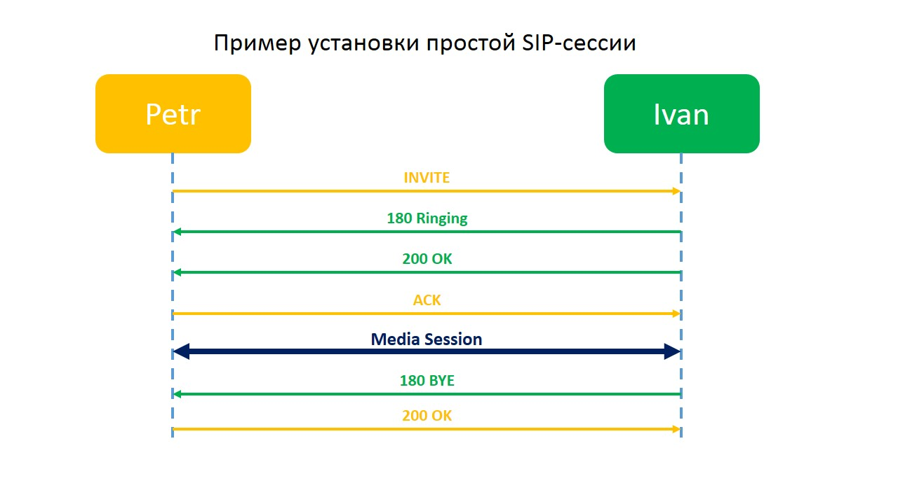

# VoIP Honeypot

Honeypot that imitates VoIP phone. It receives udp/tcp requests and send answer on:
- INVITE
- INVITE Authorization
- OPTIONS
- ACK
- BYE
- CANCEL




## Links
- [voip-hpc](https://github.com/tobiw/voip-hpc)
- [honeysip [fork of voip-hpc]](https://github.com/mushorg/honeysip)
- [SIP standarts [RFC 3261]](https://tools.ietf.org/html/rfc3261)
- [D-Link DPH-150S phone description (russian)](https://www.dlink.ru/ru/products/8/2189.html)

## Starting
- `docer-compose up`

## Logging
This Honeypot writes logs to files `.json` for Kibana and `.log` for admin to control program wrking
- [Json log](example_log.json)
- [LOG log](example_log.json)

## ToDo:
- [x] Tcp protocol
- [x] In case incorrect authorization send `400 Bad Request` or `481: b"Call/Transaction Does Not Exist",`
- [x] Finish Nmap fooler

## Device D-Link DPH-150S
##### Signaling, media and network protocols
- SIP RFC 3261
- SDP RFC 2327
- RTP RFC 1889
- SNTP
- DNS & DNS SRV
- TFTP/FTP/HTTP для автоконфигурирования
- IP/TCP/UDP/ARP/ICMP

## Examples of incoming messages:
```
=== OPTIONS ===
    OPTIONS sip:127.0.0.1 SIP/2.0
    Via: SIP/2.0/TCP 127.0.0.1:39338;rport;branch=z9hG4bKhKcExzavijtat7swla_1z84oc
    Max-Forwards: 70
    From: "Nmap NSE" <sip:user@127.0.0.1>;tag=vN3pq0L0SQnHqXpPGF9D
    To: "Nmap NSE" <sip:user@127.0.0.1>
    Call-ID: 9561yUXyBJAPZ3aaLmruyZhzw7B2gnsfinWW8tJ93JORCosOPZ8Dzf2kb4c8
    CSeq: 1234 OPTIONS
    User-Agent: Nmap NSE
    Contact: "Nmap NSE" <sip:user@127.0.0.1:39338>
    Expires: 300
    Allow: PRACK, INVITE ,ACK, BYE, CANCEL, UPDATE, SUBSCRIBE,NOTIFY, REFER, MESSAGE, OPTIONS
    Accept: application/sdp
    Content-Length:  0

=== INVITE ===
    INVITE sip:100@localhost SIP/2.0
    Via: SIP/2.0/UDP 127.0.0.1:5060;branch=z9hG4bK87asdks7
    From: socketHelper
    To: 100@localhost
    Call-ID: 1395
    CSeq: 2 INVITE
    Contact: socketHelper
    Accept: application/sdp
    Content-Type: application/sdp
    Content-Length: 126

    v=0
    o=socketHelper 5566 7788 IN IP4 127.0.0.1
    s=SDP Subject
    i=SDP information
    c=IN IP4 127.0.0.1
    t=0 0
    m=audio 30123 RTP/AVP 0

=== INVITE Authorization ===
    INVITE sip:100@localhost SIP/2.0
    Via: SIP/2.0/UDP 127.0.0.1:5060;branch=z9hG4bK87asdks7
    From: socketHelper
    To: 100@localhost
    Call-ID: 4512
    CSeq: 3 INVITE
    Contact: socketHelper
    Accept: application/sdp
    Content-Type: application/sdp
    Content-Length: 126
    Authorization: Digest username="100",
                   realm="100@localhost",
                   uri="sip:100@localhost",
                   nonce="a6b103fbb266224691906c0a60c41849",
                   response="dea6001bb802e6619a89cd5cf8d5d227"

    v=0
    o=socketHelper 5566 7788 IN IP4 127.0.0.1
    s=SDP Subject
    i=SDP information
    c=IN IP4 127.0.0.1
    t=0 0
    m=audio 30123 RTP/AVP 0
```

## Result of Nmap scanning
- `sudo nmap -sV -T4 -O -A -f --version-light 192.168.*.*` - Настоящий телефон
    ```
        Starting Nmap 7.80 ( https://nmap.org ) at 2020-11-26 12:54 MSK
        Nmap scan report for 192.168.*.*
        Host is up (0.0055s latency).
        Not shown: 997 closed ports
        PORT     STATE SERVICE VERSION
        23/tcp   open  telnet  VBrick 4300 video encoder telnetd
        80/tcp   open  http    RapidLogic httpd 1.1
        5060/tcp open  sip?
        |_sip-methods: INVITE, ACK, OPTIONS, BYE, CANCEL, REFER, NOTIFY, INFO, PRACK, UPDATE, MESSAGE
            Aggressive OS guesses: 
                Rockwell Automation 1769-L23E-QB1 PLC (93%),
                AirSpan ProST WiMAX access point (92%),
                HP ProCurve 2510 switch (91%),
                Cisco SPA 502G VoIP phone (91%),
                Xerox WorkCentre Pro 7245 printer (89%),
                Enterasys Matrix E1 switch (88%),
                HP MSA2000-series NAS device (88%),
                Nortel NVR1750D VPN router (87%),
                3Com 7760 WAP (87%),
                Linksys WRT54G or WRT54G2,
                or Netgear WGR614 or WPN824v2 wireless broadband router (87%)
        No exact OS matches for host (test conditions non-ideal).
        Network Distance: 3 hops
        Service Info: Device: media device

        TRACEROUTE (using port 143/tcp)
        HOP RTT     ADDRESS
        1   0.18 ms 192.168.*.*
        2   3.84 ms 10.2.8.1
        3   6.47 ms 192.168.*.*

        OS and Service detection performed. Please report any incorrect results at https://nmap.org/submit/ .
        Nmap done: 1 IP address (1 host up) scanned in 45.35 seconds
    ```
- `sudo nmap -sV -T4 -O -A -f --version-light 172.28.3.2` - Ловушка
```
    Starting Nmap 7.80 ( https://nmap.org ) at 2021-10-13 23:27 MSK
    Stats: 0:00:04 elapsed; 0 hosts completed (0 up), 1 undergoing ARP Ping Scan
    ARP Ping Scan Timing: About 100.00% done; ETC: 23:27 (0:00:00 remaining)
    Stats: 0:00:15 elapsed; 0 hosts completed (1 up), 1 undergoing Service Scan
    Service scan Timing: About 0.00% done
    Stats: 0:00:27 elapsed; 0 hosts completed (1 up), 1 undergoing Service Scan
    Service scan Timing: About 50.00% done; ETC: 23:28 (0:00:19 remaining)
    WARNING: RST from 172.28.3.2 port 80 -- is this port really open?
    Nmap scan report for 172.28.3.2
    Host is up (0.081s latency).
    Not shown: 997 filtered ports
    PORT     STATE  SERVICE VERSION
    23/tcp   closed telnet
    80/tcp   open   http    RapidLogic httpd 1.1
    5060/tcp open   sip     (SIP end point; Status: 200 OK)
    |_sip-methods: INVITE, ACK, OPTIONS, BYE, CANCEL, REFER, NOTIFY, INFO, PRACK, UPDATE, MESSAGE
    MAC Address: 02:42:AC:1C:03:02 (Unknown)
    Device type: VoIP phone
    Running: D-Link embedded
    OS CPE: cpe:/h:dlink:dph-150s
    OS details: D-Link DPH-150S VoIP phone
    Network Distance: 1 hop

    TRACEROUTE
    HOP RTT      ADDRESS
    1   80.92 ms 172.28.3.2

    OS and Service detection performed. Please report any incorrect results at https://nmap.org/submit/ .
    Nmap done: 1 IP address (1 host up) scanned in 47.04 seconds
```
